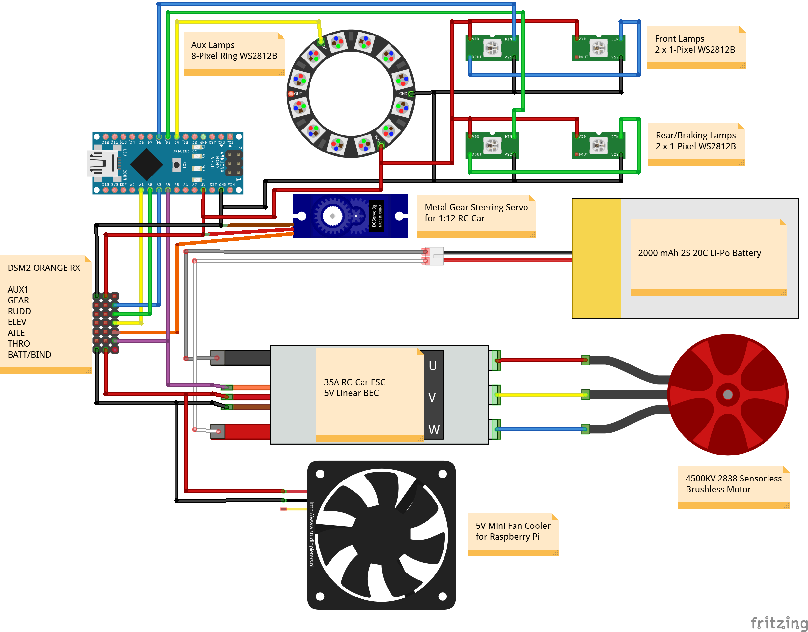
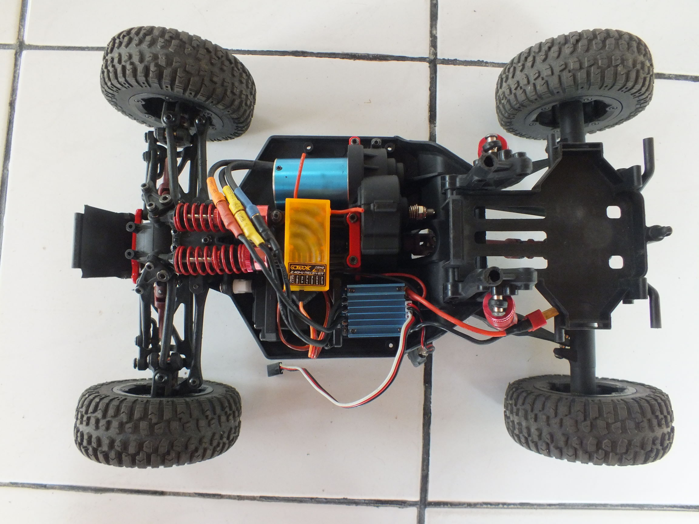
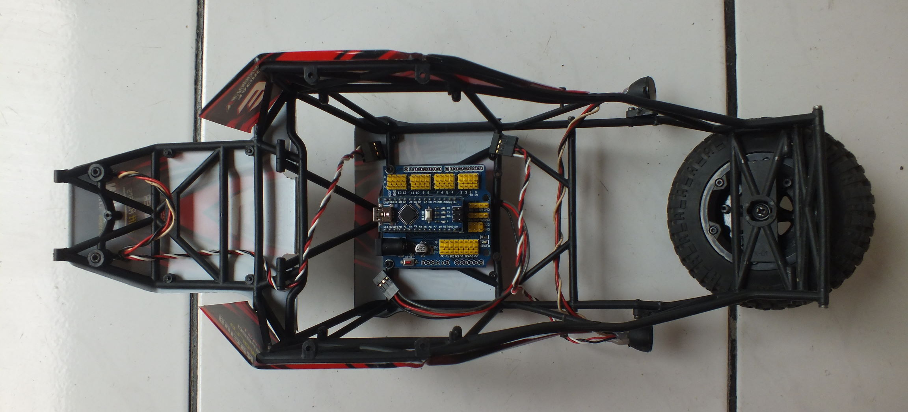
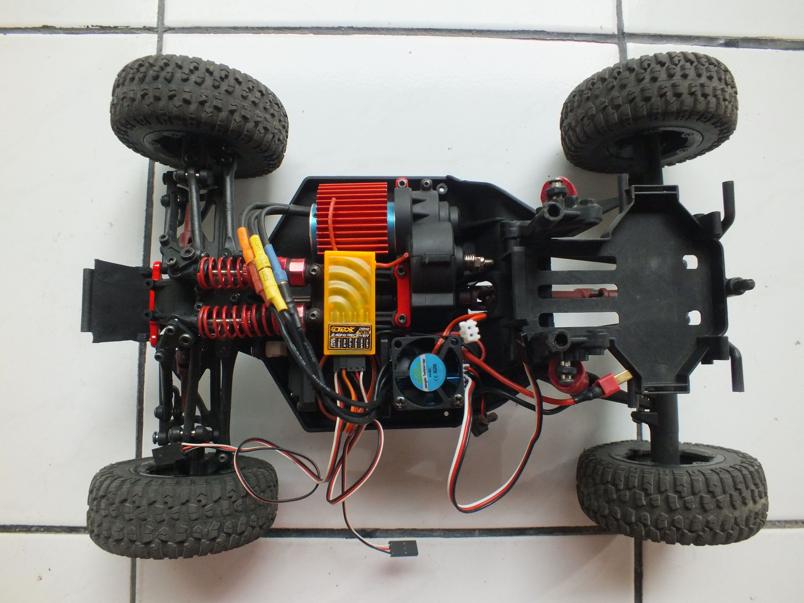
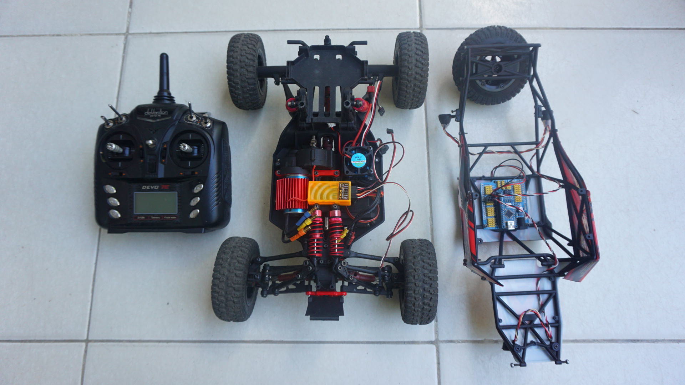

# Arduino RC-Car Lighting System

&nbsp;

## Items needed:
- Feiyue FY-03; 1:12 RC-Car (body only)
- Walkera DEVO 7E; 2.4GHz Radio Transmitter powered by DeviationTX firmware
- DSM2 Orange RX; 6-Channel 2.4GHz Radio Receiver
- Surpass Hobby 4500KV 2838 Sensorless Brushless Motor
- Surpass Hobby 35A ESC, 5V Linear BEC
- Metal Gear Steering Servo for 1:12 RC-Car
- 5V Mini Fan Cooler for Raspberry Pi
- 2000mAh 2S 20C Li-Po Battery
- Arduino Nano V3
- Arduino Nano I/O Expansion Sensor Shield Module
- 4 x 1-Pixel 24-bit RGB LED NeoPixel/WS2812B
- 8-Pixel Ring 24-bit RGB LED NeoPixel/WS2812B

&nbsp;

***Figure 1.  Wiring diagram***

&nbsp;

***Figure 2.  Feiyue FY-03 Body + Brushless Motor + 6-Ch RX + Steering Servo + ESC***

&nbsp;

***Figure 3.  Feiyue FY-03 Body Cover + Arduino Nano + I/O Expansion Shield + RGB LEDs***

&nbsp;

***Figure 4.  Adding a Mini Fan Cooler to the ESC***

&nbsp;

***Figure 5.  Walkera DEVO 7E TX + Feiyue FY-03 + Arduino Nano Lighting System***

&nbsp;

***Video 1. Binding + Lighting Test***

&nbsp;

***Video 2. Running Test***

&nbsp;

***Video 3. Binding + Lighting Test***

&nbsp;

&nbsp;

---
#### Created by ZulNs
##### @Gorontalo, Indonesia, 5 January 2020
---
